---
## Front matter
title: "Лабораторная работа № 7"
subtitle: " Модель распространения рекламы"
author: "Покрас Илья Михайлович"

## Generic otions
lang: ru-RU
toc-title: "Содержание"

## Bibliography
bibliography: bib/cite.bib
csl: pandoc/csl/gost-r-7-0-5-2008-numeric.csl

## Pdf output format
toc: true # Table of contents
toc-depth: 2
lof: true # List of figures
lot: false
fontsize: 12pt
linestretch: 1.5
papersize: a4
documentclass: scrreprt
## I18n polyglossia
polyglossia-lang:
  name: russian
  options:
	- spelling=modern
	- babelshorthands=true
polyglossia-otherlangs:
  name: english
## I18n babel
babel-lang: russian
babel-otherlangs: english
## Fonts
mainfont: PT Serif
romanfont: PT Serif
sansfont: PT Sans
monofont: PT Mono
mainfontoptions: Ligatures=TeX
romanfontoptions: Ligatures=TeX
sansfontoptions: Ligatures=TeX,Scale=MatchLowercase
monofontoptions: Scale=MatchLowercase,Scale=0.9
## Biblatex
biblatex: true
biblio-style: "gost-numeric"
biblatexoptions:
  - parentracker=true
  - backend=biber
  - hyperref=auto
  - language=auto
  - autolang=other*
  - citestyle=gost-numeric
## Pandoc-crossref LaTeX customization
figureTitle: "Рис."
tableTitle: "Таблица"
listingTitle: "Листинг"
lofTitle: "Список иллюстраций"
lotTitle: "Список таблиц"
lolTitle: "Листинги"
## Misc options
indent: true
header-includes:
  - \usepackage{indentfirst}
  - \usepackage{float} # keep figures where there are in the text
  - \floatplacement{figure}{H} # keep figures where there are in the text
---

# Цель работы

Целью данной работы является построение модели распространения рекламы.

# Задание

Построить график распространения рекламы, математическая модель которой описывается следующим уравнением:

1. $\frac{dn}{dt} = (0.618 + 0.000013n(t))(N-n(t))$

2. $\frac{dn}{dt} = (0.0000117 + 0.25n(t))(N-n(t))$

3. $\frac{dn}{dt} = (0.5sin(10t) + 0.4cos(2t)n(t))(N-n(t))$

# Ход выполнения лабораторной работы:

## Теоретическое введение 

Организуется рекламная кампания нового товара или услуги. Необходимо, чтобы прибыль будущих продаж с избытком покрывала издержки на рекламу. Вначале расходы могут превышать прибыль, поскольку лишь малая часть потенциальных покупателей будет информирована о новинке. Затем, при увеличении числа продаж, возрастает и прибыль, и, наконец, наступит момент, когда рынок насытиться, и рекламировать товар станет бесполезным.
Предположим, что торговыми учреждениями реализуется некоторая продукция, о которой в момент времени $t$ из числа потенциальных покупателей $N$ знает лишь $n$ покупателей. Для ускорения сбыта продукции запускается реклама по радио, телевидению и других средств массовой информации. После запуска рекламной кампании информация о продукции начнет распространяться среди потенциальных покупателей путем общения друг с другом. Таким образом, после запуска рекламных объявлений скорость изменения числа знающих о продукции людей пропорциональна как числу знающих о товаре покупателей, так и числу покупателей о нем не знающих
Модель рекламной кампании описывается следующими величинами.
Считаем, что $\frac{dn}{dt}$ - скорость изменения со временем числа потребителей, узнавших о товаре и готовых его купить,
$t$ - время, прошедшее с начала рекламной кампании,
$N$ - общее число потенциальных платежеспособных покупателей,
$n(t)$ - число  уже информированных клиентов.
Эта величина пропорциональна числу покупателей, еще не знающих о нем, это описывается следующим образом
$\alpha _1(t)(N-n(t))$, где $\alpha _1>0$ -  характеризует интенсивность рекламной кампании (зависит от затрат на рекламу в данный момент времени).
Помимо этого, узнавшие о товаре потребители также распространяют полученную информацию среди потенциальных покупателей, не знающих о нем (в этом случае работает т.н. сарафанное радио). Этот вклад в рекламу описывается величиной  $\alpha _2(t)n(t)(N-n(t))$. эта величина увеличивается с увеличением потребителей узнавших о товаре.

## Код на Julia:

Подключим библиотеки для дальнейшей дальнейшей работы. Далее создадим переменные общего числа потенциальных платежеспособных покупателей и числа уже информированных клиентов.. (@fig:001).

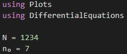{#fig:001}

Создадим  ОДУ с помощью Differential Equations системы (@fig:002).

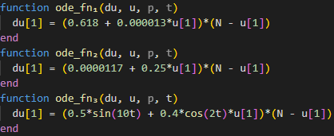{#fig:002}

С помощью solve получим решения ОДУ и сохраним данные решений в отдельные вектора(@fig:003 - @fig:004).

{#fig:003}

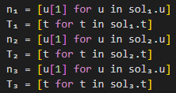{#fig:004}

Визуализируем решение с помощью Plots(@fig:005).

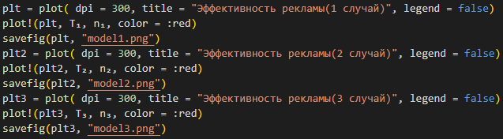{#fig:005}

Результат(Julia) (@fig:006 - @fig:008)

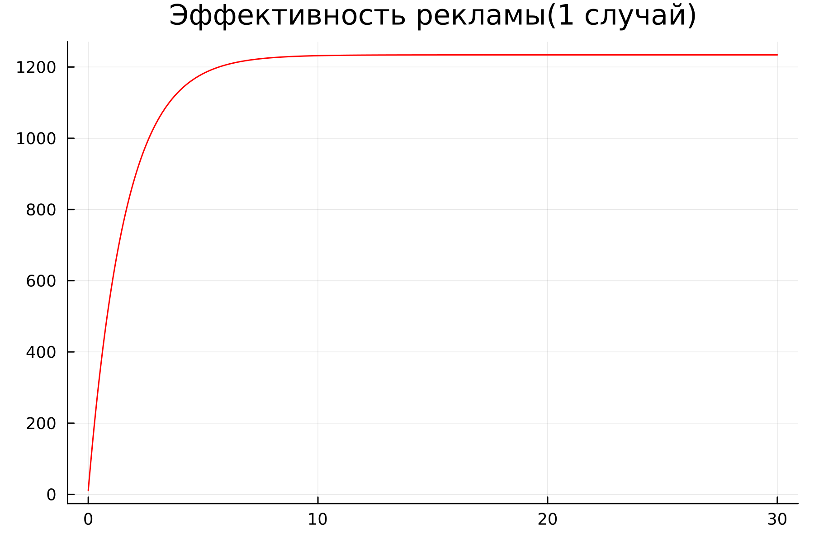{#fig:006}

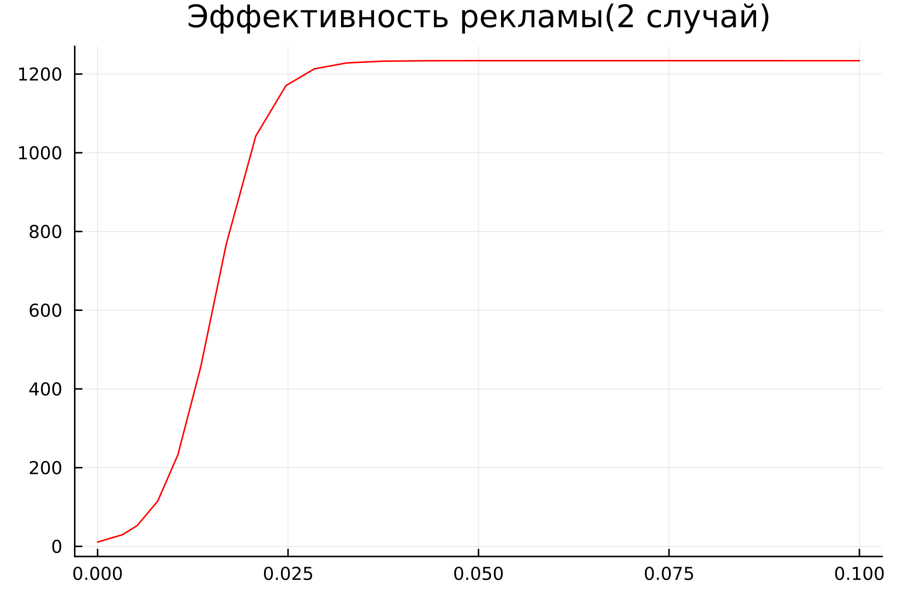{#fig:007}

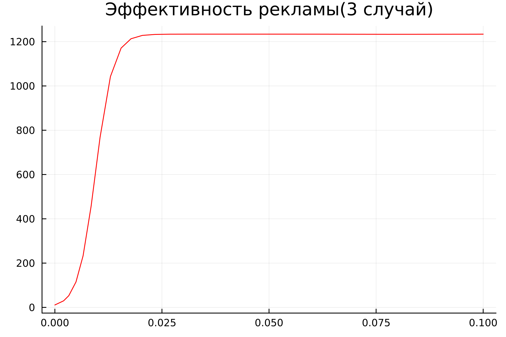{#fig:008}

## Код на OpenModelica

Для начала создадим переменные общего числа потенциальных платежеспособных покупателей и числа уже информированных клиентов. Далее запишем ОДУ (@fig:008 - @fig:010).

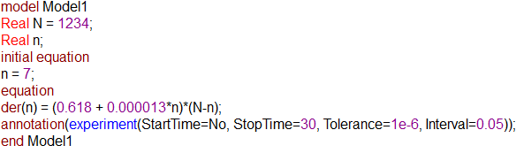{#fig:008}

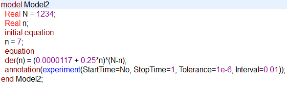{#fig:009}

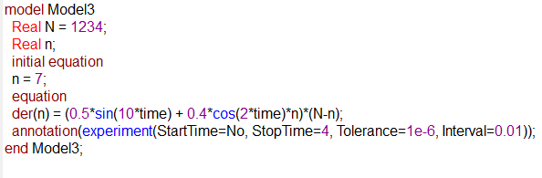{#fig:010}

Результат(Julia) (@fig:010 - @fig:012)

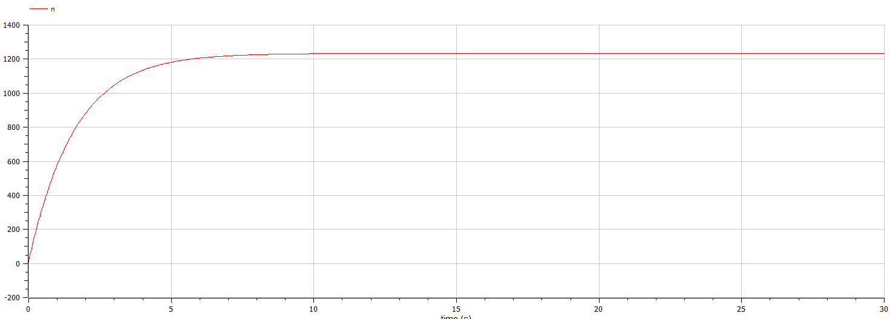{#fig:010}

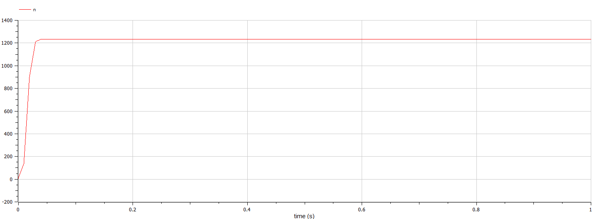{#fig:011}

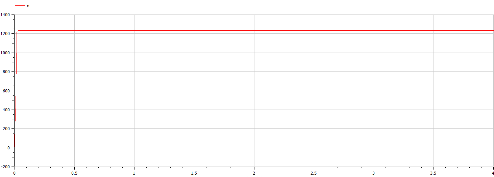{#fig:012}

# Вывод

В результате проделанной работы был написан код на Julia и OpenModelica и были построены математические модели распространения рекламы.

# Список Литературы

[1] Задания к лабораторной работе №7 (по вариантам) -  https://esystem.rudn.ru/pluginfile.php/1971669/mod_resource/content/2/Задание%20к%20лабораторной%20работе%20№%202%20%20%281%29.pdf

[2] Руководство по выполнению лабораторной работы №7 - https://esystem.rudn.ru/pluginfile.php/1971668/mod_resource/content/2/Лабораторная%20работа%20№%206.pdf